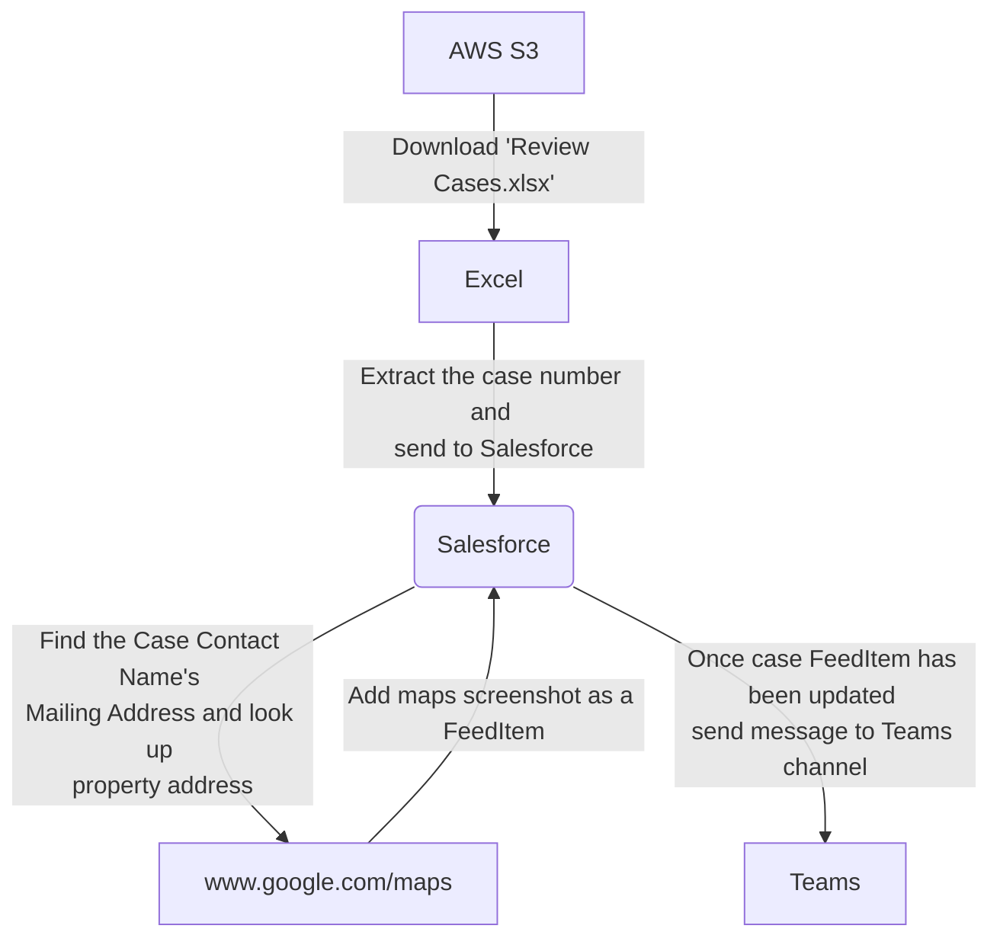

# Description

This is a simple Robot Framework and Python hybrid bot RPA project that replicates what could be a more complex business process.

The bot starts off by connecting to AWS S3 to download an excel file, extract the data from that excel file in the form of Salesforce case number, and then uses those case numbers to extract contact addresses. Those addresses are then entered into Google Maps and a screenshot is taken and saved to an output folder. Once completed it uploads the images as a FeedItem to the Salesforce case and finally sends a teams message alearting the channel that the case has been updated.

# Process Flow

# Prerequisites

1. Set up a free AWS S3 account at [AWS Free Tier](https://aws.amazon.com/free/?all-free-tier.sort-by=item.additionalFields.SortRank&all-free-tier.sort-order=asc&awsf.Free%20Tier%20Types=*all&awsf.Free%20Tier%20Categories=*all)
   1. A credit card will be required but you will only be charged if you exceed the free tier limits or after one year for certain services. AWS S3 is a 12-month free service
1. A free [Salesforce Dev](https://developer.salesforce.com/signup) account
1. Teams channel that you own or have the ability to send test messages in.
   1. Depending on your organization you may be able to create a new team
   1. Alternatively, you can also create a [free Teams](https://support.microsoft.com/en-us/office/sign-up-for-teams-free-classic-70aaf044-b872-4c32-ac47-362ab29ebbb1) account
1. A [Control Room account](https://cloud.robocorp.com/) that is connected to your VS Code so that we can leverage the [Control Room Vault for our local secrets](https://robocorp.com/docs/developer-tools/visual-studio-code/extension-features#connecting-to-control-room-vault). You will need the following secrets and key-value-pairs:
   - aws
     - AWS_KEY_ID
     - AWS_KEY
     - AWS_REGION
   - salesforce
     - base_url
       > _The section of the URL between "https://" and ".lightining.force.com"_
     - api_token
       > _Generated by clicking your name in the top right and then clicking "Settings". On the left hand menu choose "My Personal Information" > "Reset my Security Token". This will email you a security token which will be your api_token_
     - api_username
       > _What you use to log in_
     - api_password
       > _What you use to log in_
   - teams
     - uri
       > _This will be produced when you setup the channel webhook_

# AWS: Set up Instructions

1. You will need to setup one bucket in AWS S3. You will use the bucket to store the "Review Cases.xlsx" file.
1. You will need to create a new user that has access to the bucket
   - To do this follow the [AWS guide](https://docs.aws.amazon.com/IAM/latest/UserGuide/id_users_create.html) to create a new user and provide the necessary permissions
1. On the last step of creating the user you will be presented with the Key ID and Key Secret. Store these in the Control Room Vault under your "aws" secret.
1. You should also store your AWS region as a secret.

# Salesforce: Set up Instructions

1. The Salesforce Developer account comes pre-populated with Cases, Contacts, and Accounts. The case numbers in the "Review Cases.xlsx" file are the three case numbers that come preopulated.
1. Select each Contact Name next to each Case Number.
1. Click "Details" on the new page.
1. Edit the mailing address and put in a valid Mailing Address. You can generate valid random addresses using the [BestRandoms website](https://www.bestrandoms.com/random-address) if you desire.
1. Additional information on Salesforce fields and SOQL details can be found [here](https://developer.salesforce.com/docs/atlas.en-us.sfFieldRef.meta/sfFieldRef/salesforce_field_reference_Case.htm)

# Teams: Set up Instructions

1. We will be posting Teams messages through a webhook.
1. In the channel that you have permission to post messages click the three dots next to the channel name.
1. Select "Connectors".
1. Click the "Add" button next to "Incoming Webhook".
1. Once added click the "Configure" button next to "Incomeing Webhook".
1. In the new modal provide a name that the new messages will show up as in your channel. You may also update the image if you wish.
1. Click "Create".
1. Once you click "Create" you will be presented with the webhook URI. **Treat this like a private key or password.**
1. Add the URI to your vault under your Teams secret.

## Additional Learning Materials

- [All docs related to Robot Framework](https://robocorp.com/docs/languages-and-frameworks/robot-framework)
- [Vault](https://robocorp.com/docs/development-guide/variables-and-secrets/vault)
- Unit Testing
  - [Python](https://robocorp.com/docs/development-guide/qa-and-best-practices/unit-testing-with-python)
  - [Robot Framework](https://robocorp.com/docs/development-guide/qa-and-best-practices/unit-testing-with-robot-framework)
- [Using Python Robots](https://robocorp.com/docs/development-guide/qa-and-best-practices/python-robots)
- [Conda.yaml and Robot.yaml](https://robocorp.com/docs/setup/installing-python-package-dependencies)
- [RPA.Cloud.AWS Library](https://robocorp.com/docs/libraries/rpa-framework/rpa-cloud-aws)
- [RPA.Salesforce Library](https://robocorp.com/docs/libraries/rpa-framework/rpa-salesforce)
- We use the [pymsteams Libary](https://pypi.org/project/pymsteams/) to send messages to Teams via webhooks. This is the power of the Python community!
- Using [GitHub Actions](https://robocorp.com/docs/development-guide/integrations/github-actions-integration) for CI/CD