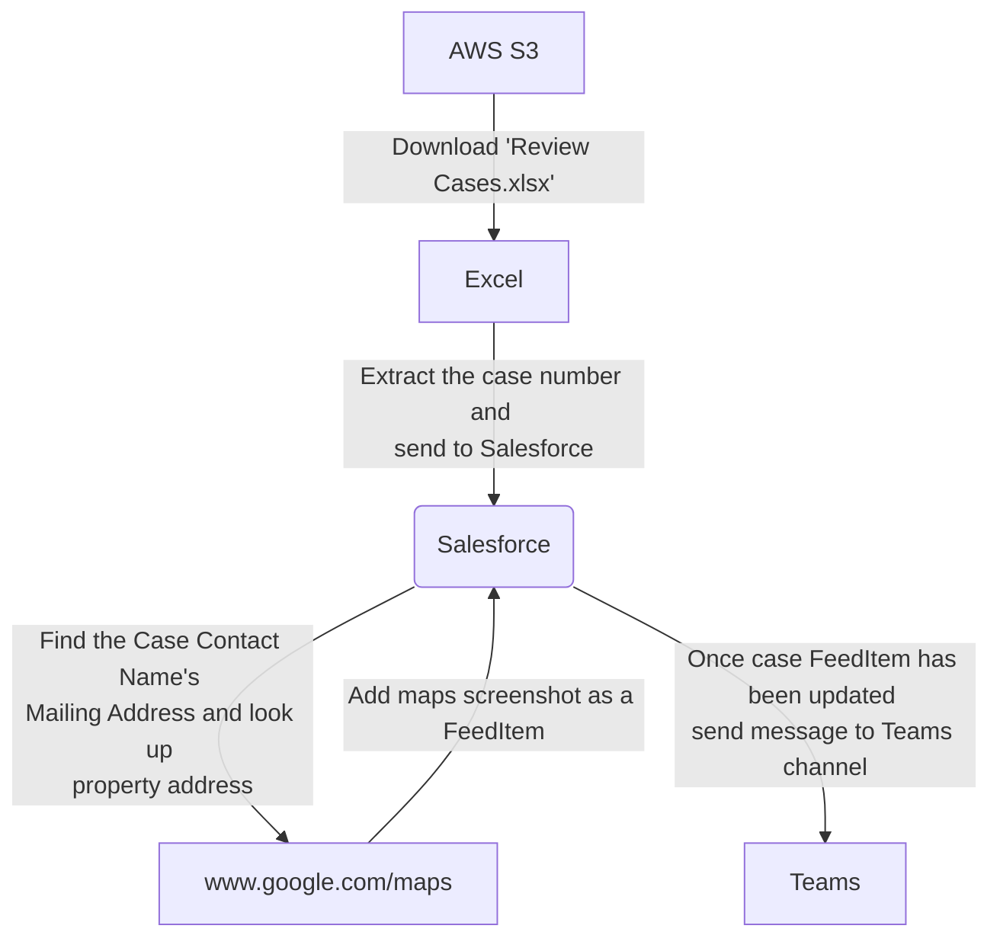

# Template: Standard Robot Framework

Want to get started using [Robot Framework](https://robocorp.com/docs/languages-and-frameworks/robot-framework/basics) this is the simplest template to start from.

This template robot:

- Uses [Robot Framework](https://robocorp.com/docs/languages-and-frameworks/robot-framework/basics) syntax.
- Includes all the necessary dependencies and initialization commands (`conda.yaml`).
- Provides a simple task template to start from (`tasks.robot`).

## Learning materials

- [All docs related to Robot Framework](https://robocorp.com/docs/languages-and-frameworks/robot-framework)
